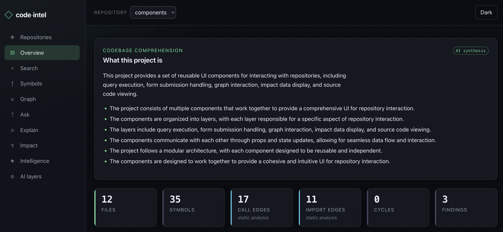
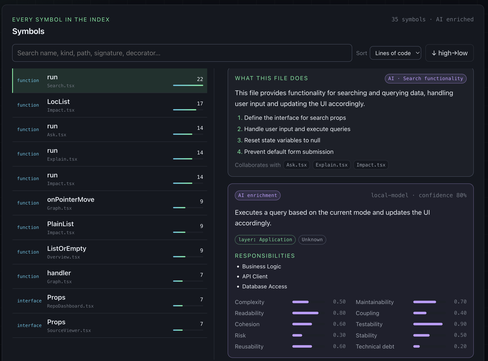
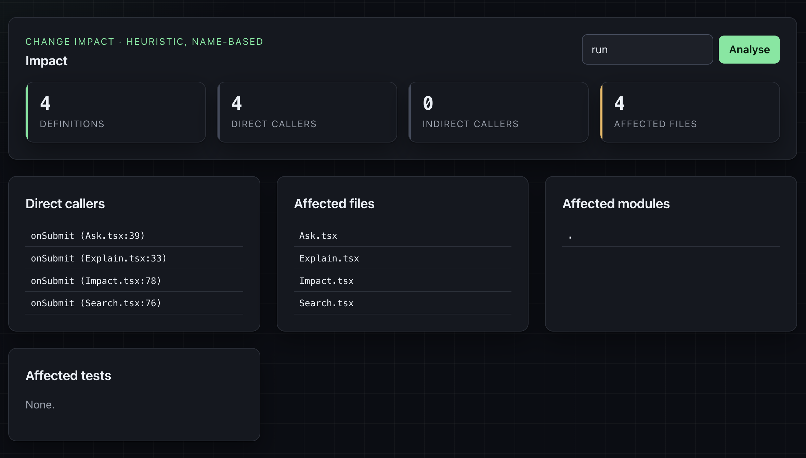
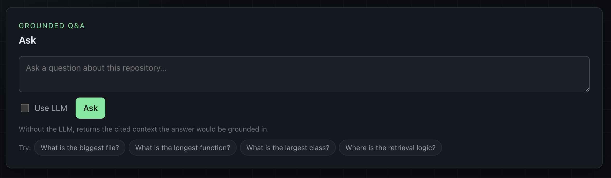

# Code Intelligence Platform

A local-first system that turns any software repository into a queryable
knowledge base, combining **deterministic static analysis** with an **optional
AI enrichment** layer. It runs entirely offline and is designed both as a
context-retrieval backend for AI coding agents and as an exploration tool for
engineers.

## Highlights

- **Deterministic by default** — ingestion, Tree-sitter parsing, symbol and
  dependency graphs, and search all run with no model and no network.
- **Multi-language** — Python, JavaScript, TypeScript, Go, Rust, Java, C, C++,
  C#, and PHP.
- **Hybrid retrieval** — blends symbol, keyword, graph-proximity, vector, and
  metadata signals into a single ranked result.
- **Optional AI layer** — summaries, grounded Q&A, and semantic embeddings via
  any OpenAI-compatible endpoint. Fully separable; the model never invents facts.
- **Provenance everywhere** — every relationship and finding carries its origin
  (static analysis vs. LLM inference) and a confidence score.
- **Three ways in** — a CLI, a FastAPI HTTP service, and a browser UI.

## Screenshots

The browser UI, running against a small indexed repository. Everything shown here
is also reachable from the CLI and the HTTP API.

**Overview** — what the project is, synthesised bottom-up from the code, next to
the deterministic counts (files, symbols, call and import edges, cycles, findings).



**Symbols** — every indexed symbol, searchable and sortable, with the per-file
explanation, its collaborators, and the optional AI enrichment (layer,
responsibilities, quality scores) side by side.



**Impact** — change-impact analysis for a symbol: definitions, direct and indirect
callers, affected files, modules, and tests.



**Ask** — grounded Q&A over the repository. With the LLM off it returns the cited
context an answer would be grounded in, so the retrieval layer stays inspectable.



## Core principle

Deterministic analysis (facts) and AI reasoning (understanding) are always
separate layers. Parsing, symbols, and the structural graph work fully with the
AI layer disabled. The LLM never parses source structure and never searches the
repository directly — all access goes through the retrieval layer.

## Architecture

Full details in [`docs/ARCHITECTURE.md`](docs/ARCHITECTURE.md). Storage
boundaries are strict and never mixed:

| Store | Owns |
|-------|------|
| **SQLite** | metadata and deterministic relational facts |
| **NetworkX** | the structural graph (behind a swappable interface) |
| **Qdrant** | embedding vectors (embedded local mode) |

## Requirements

- Python 3.12, managed via [`uv`](https://docs.astral.sh/uv/)
- Optional: Node.js 20+ and `pnpm` — only to build the browser UI
- Optional: `ripgrep` on `PATH` — keyword search falls back to pure Python
- Optional: a local OpenAI-compatible LLM endpoint — only for the AI layer

## Install

```bash
uv sync
```

## Quick start

```bash
# Index a repository (creates <repo>/.code-intel/index.db by default)
uv run code-intel index /path/to/repo

# Re-running only touches files whose contents changed
uv run code-intel index /path/to/repo

# Explore
uv run code-intel symbols  /path/to/repo
uv run code-intel stats    /path/to/repo
uv run code-intel search   --keyword TODO --path /path/to/repo -C 2
uv run code-intel retrieve "authentication flow" --path /path/to/repo
uv run code-intel graph    Indexer --path /path/to/repo
uv run code-intel impact   authenticate --path /path/to/repo
```

## CLI

| Command | Purpose |
|---------|---------|
| `index` / `update` | Build or incrementally refresh the index |
| `symbols` / `symbol` | List or search symbols |
| `search` | Keyword / regex search |
| `retrieve` | Hybrid retrieval |
| `graph` | Structural neighbourhood around a symbol |
| `stats` | Dependency and health report |
| `explain` | Hierarchical summaries |
| `ask` | Grounded Q&A with citations |
| `impact` | Change-impact analysis |
| `intel` | Repository findings (diffable) |
| `enrich` / `embed` | Optional AI layers |
| `serve` / `ui` | Run the HTTP API and browser UI |
| `config` / `health` / `delete` | Inspect config, verify a store, remove one |

Run `uv run code-intel --help` for the full surface. Override the database
location with `--db` or `CODE_INTEL_DB`.

## Browser UI & HTTP API

The whole pipeline is reachable over HTTP, with a browser UI served from the same
process — the terminal is only needed to launch it.

```bash
uv sync --extra serve      # adds uvicorn
uv run code-intel ui       # serve API + UI and open the browser
```

- UI at `http://127.0.0.1:8000/`; interactive API schema at `/docs`.
- All endpoints are namespaced under `/api`. Indexing, updating, enriching, and
  embedding run as **background jobs** — the request returns a job id and the
  client polls `GET /api/jobs/{id}` for progress and the result.
- Indexed repositories are remembered in `~/.code-intel/registry.json` (override
  with `CODE_INTEL_REGISTRY`).

The UI covers the full pipeline: a repository dashboard (browse-to-add,
index/update/delete with live progress), an overview (stats, languages, findings),
search (keyword / symbol / hybrid), a symbols browser and source viewer, an
interactive graph explorer, grounded Q&A, explain, impact, a filterable
intelligence view, and the optional enrich/embed runners.

### Building the UI

The frontend is a Next.js app in [`web/`](web/), statically exported and served by
FastAPI (no Node process at runtime). The generated bundle is not committed; build
it into the package with:

```bash
cd web && pnpm install && pnpm build:webui   # → src/code_intel/webui/
```

Until the UI is built, the API is fully usable on its own and `/` returns 404.

Frontend dev loop (hot reload): run `uv run code-intel serve` in one terminal and
`cd web && pnpm dev` in another (it proxies to `:8000`).

## Configuration

Everything is configurable; nothing is hardcoded. Key environment variables:

| Variable | Purpose |
|----------|---------|
| `CODE_INTEL_DB` | Override the SQLite database path |
| `CODE_INTEL_REGISTRY` | Override the repository registry path |
| `CODE_INTEL_UI_DIR` | Override the served UI directory |
| `CODE_INTEL_LLM_BASE_URL` / `_MODEL` / `_API_KEY` / … | OpenAI-compatible LLM settings |

`uv run code-intel config` prints the effective configuration.

## Development

```bash
uv run pytest                          # tests
uv run ruff check src tests            # lint
uv run mypy                            # type-check (strict)
cd web && pnpm typecheck && pnpm e2e   # frontend checks (e2e needs a running server)
```

## Project layout

```
src/code_intel/      # library, CLI, and HTTP API
  ingestion/  parsing/  graph/  symbols/  dependencies/
  retrieval/  understanding/  intelligence/  enrichment/
  embeddings/ vectorstore/ keyword_search/ llm/ storage/
  cli/  api/  webui/   (webui holds the generated UI)
tests/               # unit, integration, and API tests
web/                 # Next.js frontend (source)
docs/                # architecture and component notes (+ screenshots/)
```

## License

Released under the [MIT License](LICENSE). Copyright © 2026 Blueforge.
